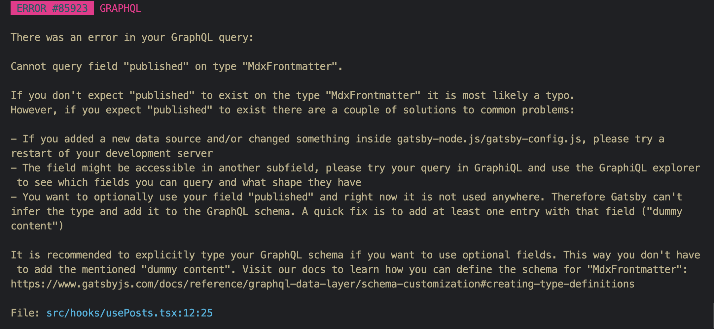

# 곱하기 혹은 더하기

## 문제 설명

```text
$ give me super-powers
```





Once you're strong enough, save the world:


```bash
# Ain't no code for that yet, sorry
echo 'You got to trust me on this, I saved the world'
```




